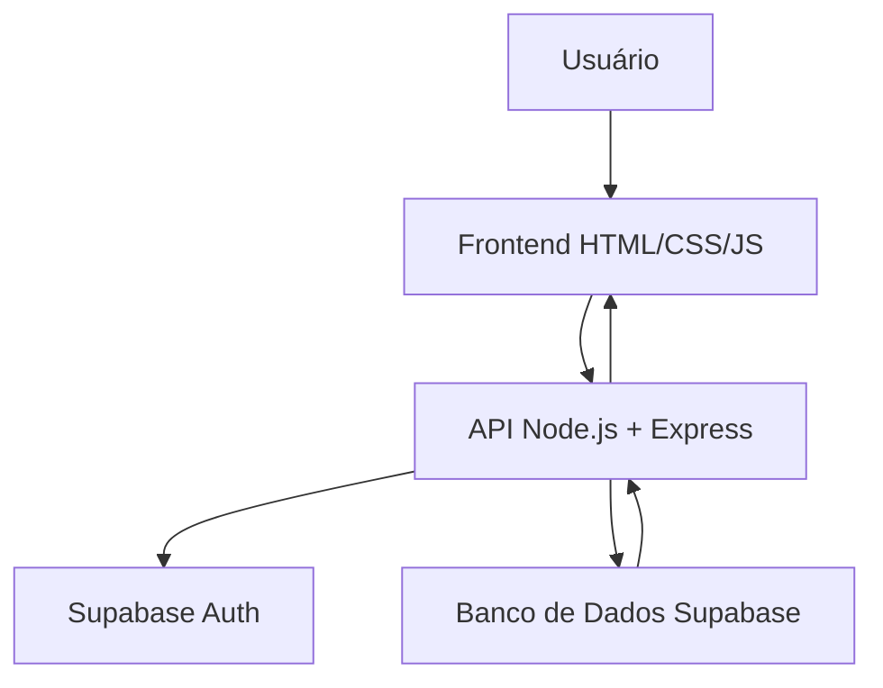
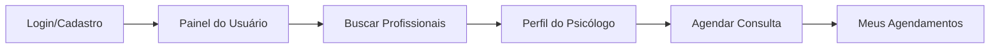
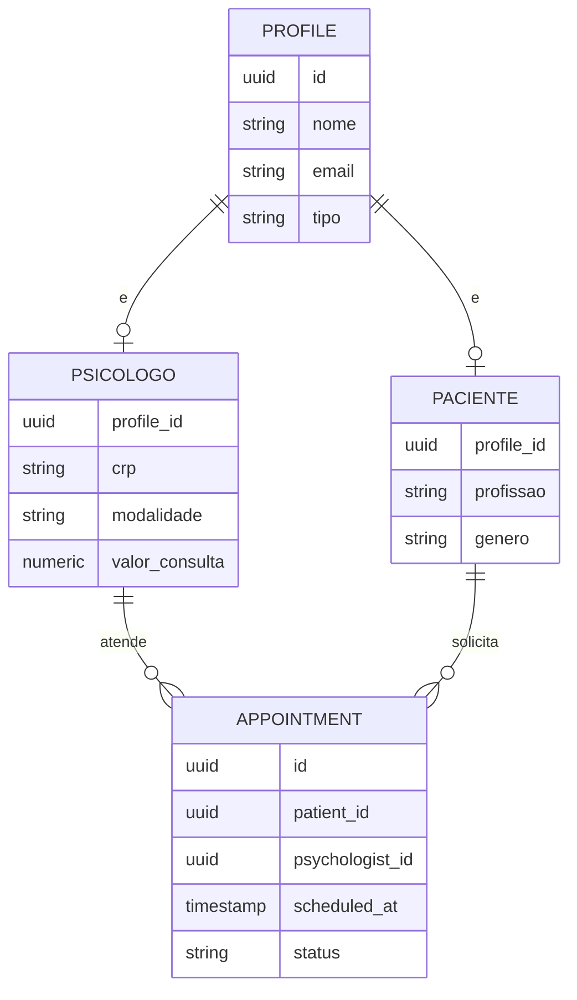
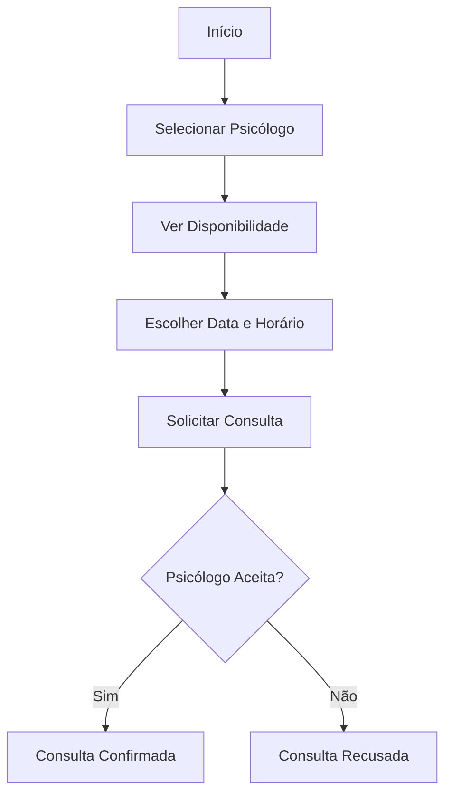

# Psicocenter 🧠💙

<p align="center">


</p>

<h1 align="center">Psicocenter</h1>

<p align="center">
Plataforma web que conecta psicólogos e pacientes, simplificando a busca por profissionais e o agendamento de consultas.
</p>

---

# 📌 Sobre o projeto

O Psicocenter é uma plataforma web desenvolvida como Trabalho de Conclusão de Curso (TCC) com o objetivo de facilitar a conexão entre psicólogos e pacientes.

O projeto centraliza o cadastro de profissionais, a busca por especialidades, o agendamento de consultas e o acompanhamento de atendimentos, substituindo processos manuais e dispersos por uma solução digital acessível.

A plataforma foi projetada para dar autonomia ao paciente na escolha do profissional ideal e facilitar a gestão da agenda do psicólogo.

---

# 🎯 Objetivo

Criar um ambiente centralizado que permita:

- 🧑‍⚕️ Cadastrar e gerenciar perfis de psicólogos e pacientes;
- 🔍 Buscar profissionais por especialidade, modalidade e valor da sessão;
- 📅 Solicitar, aceitar, recusar e cancelar consultas;
- 👥 Acompanhar os pacientes atendidos por cada psicólogo;
- 🔒 Controlar o acesso e os dados de cada tipo de usuário;
- 📱 Disponibilizar uma interface responsiva e acessível.

---

# ⚙️ Como funciona?

O sistema organiza o fluxo de atendimento em etapas simples:

1. O usuário se cadastra como paciente ou psicólogo.
2. O usuário realiza o login e é direcionado ao seu painel.
3. O paciente busca profissionais por especialidade e modalidade.
4. O paciente solicita uma consulta dentro da disponibilidade do psicólogo.
5. O psicólogo aceita ou recusa a solicitação.
6. Consultas aceitas ficam visíveis para os dois lados até serem concluídas ou canceladas.

---

# 📐 Diagrama 1 - Arquitetura Geral



---

# 📊 Diagrama 2 - Fluxo de Utilização



---

# 🗄️ Diagrama 3 - Entidade Relacionamento



---

# 🔄 Diagrama 4 - Fluxo de Agendamento de Consulta



---

# 🛠️ Tecnologias Utilizadas

### Frontend

- HTML5 / CSS3
- JavaScript
- Boxicons

### Backend

- Node.js
- Express
- JWT (autenticação)

### Banco de Dados

- Supabase (PostgreSQL + Auth)

### Ferramentas

- Git
- GitHub

---

# 📂 Estrutura do Projeto

```bash
views/       # páginas HTML
style/       # arquivos CSS
js/          # scripts do frontend
images/      # imagens e assets
backend/
  controllers/
  routes/
  services/
  middleware/
  config/
```

---

# 🚀 Executando o projeto

Clone o repositório:

```bash
git clone https://github.com/matheusballardini/TCC-2026.git
```

Entre na pasta do backend e instale as dependências:

```bash
cd backend
npm install
```

Configure as variáveis de ambiente (crie um arquivo `.env` na pasta `backend` com `SUPABASE_URL`, `SUPABASE_ANON_KEY`, `SUPABASE_SERVICE_ROLE_KEY` e `JWT_SECRET`).

Execute o backend:

```bash
npm run dev
```

Abra a pasta `views/` com um servidor local (ex: extensão Live Server do VS Code) e acesse:

```bash
http://127.0.0.1:5500/views/index.html
```

---

# 🎓 Projeto Acadêmico

Projeto desenvolvido como Trabalho de Conclusão de Curso (TCC) aplicando conceitos de:

- Engenharia de Software
- Banco de Dados
- Arquitetura de Sistemas
- Desenvolvimento Web
- UX/UI

---

# 👨‍💻 Equipe

Projeto desenvolvido pela equipe do TCC 2026.

Matheus Ballardini

Bruno Richopo

Enzo Marques

Antônio Godoy

Vinicius Cárceres
