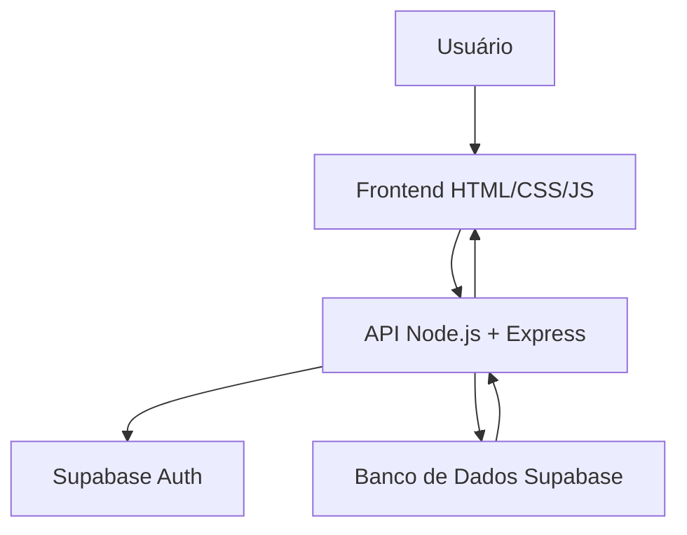
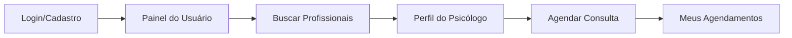
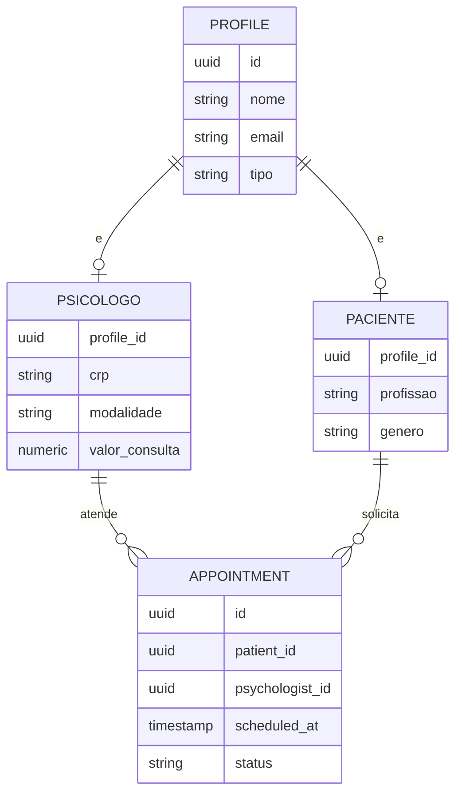
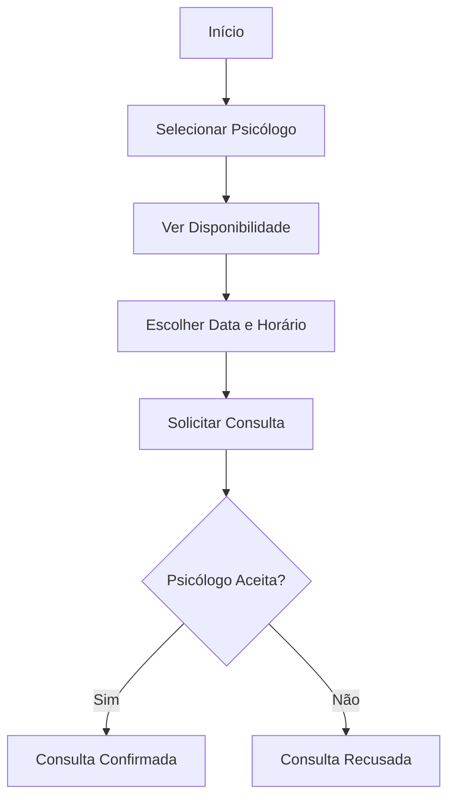

# Psicocenter 🧠💙

<p align="center">


</p>

<h1 align="center">Psicocenter</h1>

<p align="center">
Plataforma web que conecta psicólogos e pacientes, simplificando a busca por profissionais e o agendamento de consultas.
</p>

<p align="center">
🔗 <strong>Acesse a versão em produção:</strong> <a href="https://psicocenter-project.vercel.app">psicocenter-project.vercel.app</a>
</p>


# 📌 Sobre o projeto

O Psicocenter é uma plataforma web desenvolvida como Trabalho de Conclusão de Curso (TCC) com o objetivo de facilitar a conexão entre psicólogos e pacientes.

O projeto centraliza o cadastro de profissionais, a busca por especialidades, o agendamento de consultas e o acompanhamento de atendimentos, substituindo processos manuais e dispersos por uma solução digital acessível.

A plataforma foi projetada para dar autonomia ao paciente na escolha do profissional ideal e facilitar a gestão da agenda do psicólogo.


# 🎯 Objetivo

Criar um ambiente centralizado que permita:

• 🧑‍⚕️ Cadastrar e gerenciar perfis de psicólogos e pacientes;
• 🔍 Buscar profissionais por especialidade, modalidade e valor da sessão;
• 📅 Solicitar, aceitar, recusar e cancelar consultas;
• 👥 Acompanhar os pacientes atendidos por cada psicólogo;
• 🔒 Controlar o acesso e os dados de cada tipo de usuário;
• 📱 Disponibilizar uma interface responsiva e acessível.


# ⚙️ Como funciona?

O sistema organiza o fluxo de atendimento em etapas simples:

1. O usuário se cadastra como paciente ou psicólogo.
2. O usuário realiza o login e é direcionado ao seu painel.
3. O paciente busca profissionais por especialidade e modalidade.
4. O paciente solicita uma consulta dentro da disponibilidade do psicólogo.
5. O psicólogo aceita ou recusa a solicitação.
6. Consultas aceitas ficam visíveis para os dois lados até serem concluídas, canceladas ou reagendadas.


# ✨ Funcionalidades

### Autenticação e conta
• Cadastro separado para paciente e psicólogo (com CRP, especialidades, modalidade e valor da consulta no caso do psicólogo);
• Login com JWT, recuperação de senha e exclusão de conta;
• Edição completa de perfil, incluindo troca de foto com compressão automática no navegador.

### Busca e agendamento
• Busca de profissionais por especialidade, modalidade e faixa de valor;
• Consulta de disponibilidade do psicólogo antes de agendar;
• Solicitação, aceite, recusa, cancelamento e reagendamento de consultas;
• Histórico de "Meus agendamentos" tanto para paciente quanto para psicólogo.

### Comunicação
• Chat privado entre paciente e psicólogo vinculado a uma consulta;
• Notificações em tempo real (sino flutuante) para solicitações, aceites, cancelamentos e novas mensagens.

### Avaliações
• Paciente e psicólogo podem se avaliar mutuamente após a consulta;
• Resumo de avaliações (média e comentários) visível no perfil de cada um.

### Outros
• Interface responsiva (desktop e mobile);
• Ícones em SVG (Heroicons/Boxicons), sem dependência de imagens externas para a UI;
• Deploy único na Vercel (frontend estático + backend como função serverless).


# 📐 Diagrama 1: Arquitetura Geral


```mermaid
graph TD

A[Usuário]

B[Frontend HTML/CSS/JS]

C[API Node.js + Express]

D[Supabase Auth]

E[Banco de Dados Supabase]

A --> B

B --> C

C --> D

C --> E

E --> C

C --> B
```


# 📊 Diagrama 2: Fluxo de Utilização


```mermaid
graph LR

A[Login/Cadastro]

B[Painel do Usuário]

C[Buscar Profissionais]

D[Perfil do Psicólogo]

E[Agendar Consulta]

F[Meus Agendamentos]

A --> B

B --> C

C --> D

D --> E

E --> F
```


# 🗄️ Diagrama 3: Entidade Relacionamento


```mermaid
erDiagram

PROFILE ||--o| PSICOLOGO : e
PROFILE ||--o| PACIENTE : e
PSICOLOGO ||--o{ APPOINTMENT : atende
PACIENTE ||--o{ APPOINTMENT : solicita

PROFILE {
uuid id
string nome
string email
string tipo
}

PSICOLOGO {
uuid profile_id
string crp
string modalidade
numeric valor_consulta
}

PACIENTE {
uuid profile_id
string profissao
string genero
}

APPOINTMENT {
uuid id
uuid patient_id
uuid psychologist_id
timestamp scheduled_at
string status
}
```


# 🔄 Diagrama 4: Fluxo de Agendamento de Consulta


```mermaid
graph TD

A[Início]

B[Selecionar Psicólogo]

C[Ver Disponibilidade]

D[Escolher Data e Horário]

E[Solicitar Consulta]

F{Psicólogo Aceita?}

G[Consulta Confirmada]

H[Consulta Recusada]

A --> B

B --> C

C --> D

D --> E

E --> F

F -->|Sim| G

F -->|Não| H
```


# 🛠️ Tecnologias Utilizadas

### Frontend

• HTML5 / CSS3
• JavaScript
• Boxicons

### Backend

• Node.js
• Express
• JWT (autenticação)

### Banco de Dados

• Supabase (PostgreSQL + Auth)

### Ferramentas

• Git
• GitHub


# 📂 Estrutura do Projeto

```bash
views/       # páginas HTML
style/       # arquivos CSS
js/          # scripts do frontend
images/      # imagens e assets
backend/
  controllers/
  routes/
  services/
  middleware/
  config/
```


# 🚀 Executando o projeto

### Opção 1 — Usar a versão publicada

A forma mais simples de conhecer o Psicocenter é acessando a versão já publicada na Vercel, sem precisar instalar nada:

🔗 **https://psicocenter-project.vercel.app**

### Opção 2 — Rodar localmente

Clone o repositório:

```bash
git clone https://github.com/matheusballardini/PSICOCENTER.git
```

Entre na pasta do backend e instale as dependências:

```bash
cd backend
npm install
```

Configure as variáveis de ambiente (crie um arquivo `.env` na pasta `backend` com `SUPABASE_URL`, `SUPABASE_ANON_KEY`, `SUPABASE_SERVICE_ROLE_KEY` e `JWT_SECRET`).

Execute o backend:

```bash
npm run dev
```

Abra a pasta `views/` com um servidor local (ex: extensão Live Server do VS Code) e acesse:

```bash
http://127.0.0.1:5500/views/index.html
```

O frontend detecta automaticamente se está rodando local ou em produção (`js/api-config.js`), então não é preciso trocar nenhuma URL manualmente.


# 📖 Como usar

1. Acesse a plataforma (local ou pela URL publicada) e clique em **Entrar**;
2. Escolha se quer se cadastrar como **paciente** ou **psicólogo** e preencha o formulário;
3. Faça login com o email e senha cadastrados;
4. **Se for paciente:** use "Buscar profissionais" para filtrar psicólogos por especialidade/modalidade/valor, veja o perfil de quem te interessar e solicite uma consulta num horário disponível;
5. **Se for psicólogo:** configure sua disponibilidade no perfil e acompanhe as solicitações de consulta em "Agendamentos", podendo aceitar, recusar, cancelar ou reagendar;
6. Use o chat para conversar com a outra parte antes/depois da consulta, e acompanhe avisos pelo sino de notificações;
7. Após a consulta, avalie o atendimento — a avaliação fica visível no perfil de quem foi avaliado.


## Termos de Uso e Compartilhamento

*Autores:* Matheus Ballardini, Bruno Richopo, Enzo Marques, Antônio Godoy, Vinicius Cárceres
*Orientador(a):* Mateus Redivo
*Projeto:* Psicocenter, TCC Informática, Bento Quirino, 2026

©️ 2026 Matheus Ballardini, Bruno Richopo, Enzo Marques, Antônio Godoy, Vinicius Cárceres. Todos os direitos reservados,
exceto o que está expressamente permitido abaixo.

### Permitido
• Consultar e estudar o código para fins educacionais.
• Uso para avaliação do TCC e apresentação acadêmica.
• Uso não comercial por terceiros, desde que respeitadas
  as condições de crédito abaixo.

### Condições
1. *Crédito obrigatório:* qualquer uso, cópia, adaptação ou
   divulgação deve citar os autores pelo nome e incluir
   link para este repositório.
2. *Sem fins lucrativos:* é proibido usar, vender, licenciar
   ou oferecer este código (ou derivados) como produto ou
   serviço comercial sem contratar os autores previamente.
3. *Uso institucional:* o uso pela instituição de ensino
   além da avaliação do TCC (outros projetos, sistemas
   internos, divulgação) depende de autorização prévia e
   por escrito dos autores.
4. *Derivados:* trabalhos derivados devem manter este aviso
   e indicar o que foi alterado.

### Contato
Para solicitar autorização ou contratar os autores:
matheusinho.bal@gmail.com

### Isenção de garantia
O software é fornecido "como está", sem garantias de qualquer tipo.


# 🎓 Projeto Acadêmico

Projeto desenvolvido como Trabalho de Conclusão de Curso (TCC) aplicando conceitos de:

• Engenharia de Software
• Banco de Dados
• Arquitetura de Sistemas
• Desenvolvimento Web
• UX/UI


# 👨‍💻 Equipe

Projeto desenvolvido pela equipe do TCC 2026.

### Orientador

Mateus Redivo

### Alunos

Matheus Ballardini

Bruno Richopo

Enzo Marques

Antônio Godoy

Vinicius Cárceres
